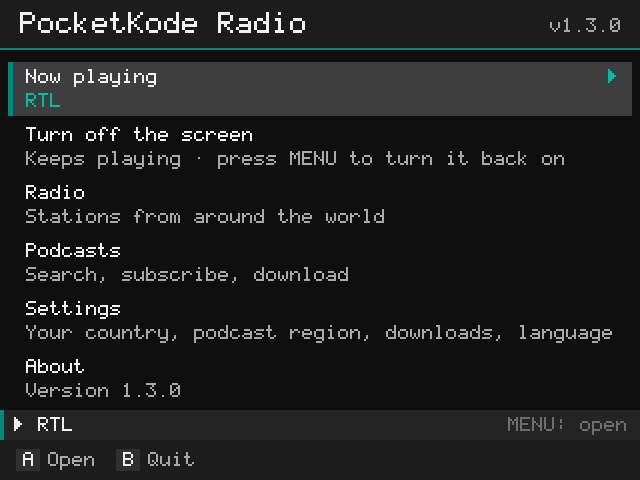
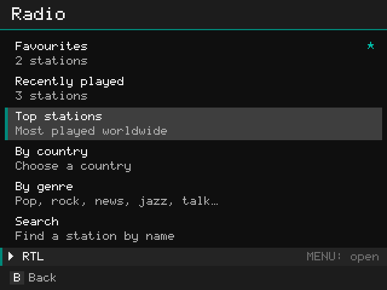
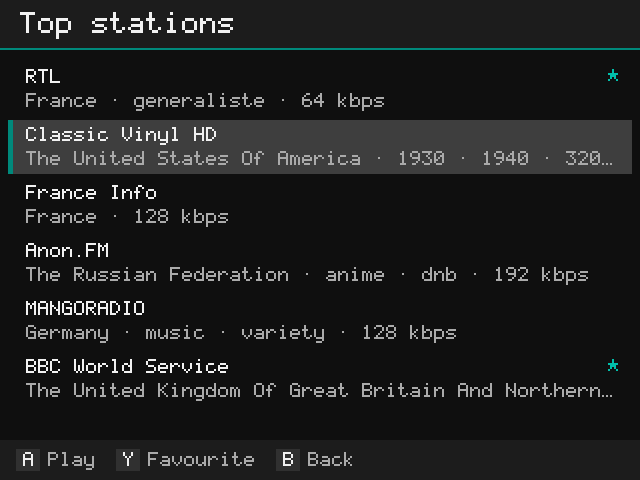
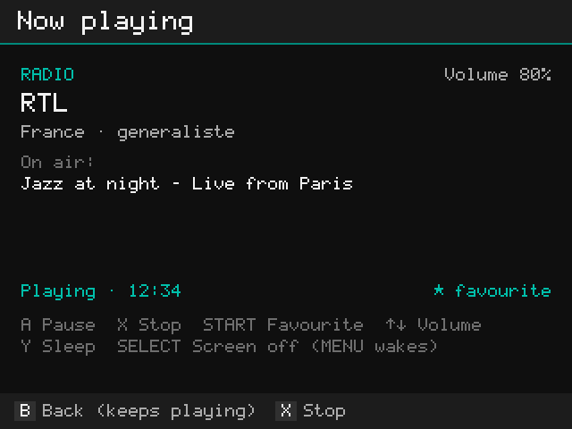

# PocketKode Radio

**Internet radio and podcasts for muOS handhelds**, with the screen off to save battery. Free and open source
([MIT License](LICENSE)). No account, no ads, no tracking.

Tested on the Anbernic RG40XXH with muOS 2601.0 Jacaranda. Other muOS devices with Wi-Fi may work: reports are welcome.

| | |
|---|---|
|  |  |
|  |  |

## Install

Download `PocketKodeRadio-<version>.muxapp` from the [latest release](https://github.com/pocketkode/pocketkode-radio/releases/latest),
copy it to the `ARCHIVE` folder on SD card 1, then open **Applications → Archive Manager** and install it. Turn on
**Wi-Fi**, then open **Applications → PocketKode Radio**.

## Radio

Thousands of stations from around the world, from the community-run [Radio Browser](https://www.radio-browser.info) directory.

- **Top stations**, **By country**, **By genre** and **Search**.
- Press **Y** on a station to add it to **Favourites**. **Recently played** remembers your last 15.
- In **By country**, press **Y** to make a country **My country**: its stations then get their own entry in the Radio menu.
- Many stations show the song or show that's **on air**.

## Podcasts

- **Search** or browse **Top podcasts** (Apple's public charts; choose the country in Settings).
- Press **Y** to **subscribe**; your shows are in **My podcasts**.
- In a show's episode list: **A** play, **X** download (again to cancel, or to delete a download), **Y** mark as played, **START** subscribe.
- While an episode plays (**Now playing**), **START** downloads it; the progress shows on the screen.
- **Downloads** play without Wi-Fi. Where you stopped is remembered for every episode.

## Now playing

| Button | Radio | Podcast |
|---|---|---|
| A | Pause / play | Pause / play |
| ◀ / ▶ | | Back 15 s / forward 30 s |
| L1 / R1 | | Slower / faster (0.75x to 2x) |
| START | Favourite | |
| Y | Sleep timer (15, 30, 45, 60, 90 min, off) | Sleep timer |
| SELECT | **Screen off** (only **MENU** turns it back on, so a button pressed in a bag doesn't) | Screen off |
| X | Stop | Stop |
| B | Back; keeps playing | Back; keeps playing |

**Volume:** use the handheld's **VOL+ / VOL−** buttons. Now playing shows the handheld's volume, and says so
when the sound is off.

While something plays, a bar at the bottom of every screen shows it; press **MENU** to open Now playing.

## Settings

- **My country**, **Podcast charts** country, **Language**, **Delete all downloads** (subscriptions and progress are
  kept) and **Check for updates** (on or off).

## Language

English, 日本語 (Japanese), Español, Français, Deutsch, Nederlands, Русский, 简体中文 (Simplified Chinese) or 한국어
(Korean). The app follows muOS's language (**Configuration > Language**); any other language means English. To choose
yourself, open **Settings → Language** and press **A** or **◀ ▶** (Auto → English → 日本語 → … → 한국어); the choice is kept.
English uses the app's own pixel font; the other languages use the Noto Sans JP, SC and KR fonts (see
[Third-party](#third-party)).

## Notes

- Radio and streaming need **Wi-Fi**. Downloaded episodes don't.
- In English, station and podcast names use the app's pixel font (accented letters appear without accents); names in
  other scripts, such as Japanese, Chinese, Korean or Cyrillic, use the Noto fonts.
- Nothing is recorded or re-shared. Streams and episodes belong to their broadcasters and creators.

## Privacy

PocketKode Radio never reads or sends your files, and doesn't record anything.

For updates it reads the latest release on GitHub (you can turn this off in **Settings**). It sends nothing about you
or the handheld.

Stations come from **Radio Browser**, podcasts from **Apple's podcast directory**, and the sound from each station or
show itself. Your searches go to those services. When you play a station, Radio Browser is told that the station was
played (an anonymous count that keeps its Top list up to date).

Your favourites, subscriptions and history stay on the handheld. No ads, no analytics, no tracking.

## Updates

When the handheld is online, the app reads `update.json` from this repository's latest release (at start and once a
day) and shows **Update available** with what's new. Nothing is installed unless you choose **Update**. The download
is checked (its SHA-256 and PocketKode's Ed25519 signature, public key in `updater.py`) before anything changes, and
the new version is installed when the app restarts (**Restart now**); your stations, podcasts and settings stay. If an
updated version doesn't start, the app goes back to the previous one by itself. Turn it off in
**Settings → Check for updates**.

## Troubleshooting

- **"No internet connection":** turn on Wi-Fi in **Configuration → Network**.
- **"Secure connection failed":** the handheld's date and time are wrong. Fix them in muOS's settings.
- **A station doesn't play:** some stations go offline or change address; try another. Logs: `logs/app.log` and
  `logs/mpv.log` in the app folder.

## Building

Needs bash, zip, unzip, curl, shasum and Python 3 (macOS or Linux).

```sh
git clone https://github.com/pocketkode/pocketkode-radio.git
cd pocketkode-radio
./build.sh
```

This makes `dist/PocketKodeRadio.muxapp`, the package you install with Archive Manager. The app is plain Python 3
and uses the Python, SDL2, SDL2_ttf and mpv that come with muOS; the build only adds the Noto fonts (downloaded once
and checked against their SHA-256). `dist/stage/PocketKodeRadio/` holds the same files unpacked.

## Running

The app runs on the handheld (it reads the buttons from the Linux input device and plays through muOS's mpv).

- **Install the package:** copy `dist/PocketKodeRadio.muxapp` to `ARCHIVE` on SD card 1 and install it with
  **Applications → Archive Manager**. Close the app first if it's open.
- **Try a change quickly:** copy the changed files over the installed app in `MUOS/application/PocketKodeRadio/` on
  SD card 1 (for example with muOS's SFTP: **Configuration → Web Services**), then start **PocketKode Radio** again.
  Your stations and settings in `data/` are kept.
- **Logs:** `logs/app.log` (the app) and `logs/mpv.log` (the player) in the app folder.

A build of your own can't install PocketKode's updates over itself unless it's signed with PocketKode's key, so for a
fork change `REPO` and `UPDATE_KEY` in `updater.py`, or turn updates off in Settings.

## Project layout

The app folder follows the layout of muOS's own applications:

| Path | What it is |
|---|---|
| `mux_launch.sh` | The launcher muOS runs (its `HELP`, `ICON` and `GRID` lines name the app) |
| `mux_lang.ini` | The app's name and help text in the muOS languages |
| `glyph/` | The app icon |
| `main.py` | Starts the app (and finishes a downloaded update first) |
| `pkradio/` | The app itself: screens (`app.py`), drawing (`gfx.py`, `font.py`, `ttf.py`, `sdl.py`), buttons (`pad.py`), playback (`player.py`), Radio Browser (`radio.py`), podcasts (`podcasts.py`), saved state (`store.py`), updates (`updater.py`, `update_screen.py`) |
| `lang/` | Translations, one JSON file per language |
| `fonts/`, `licenses/` | The Noto fonts and their licences (added by `build.sh`) |
| `data/`, `logs/` | Made on the handheld: your stations and settings, and the logs |

## Contributing

Bug reports, station or podcast problems, translations and pull requests are welcome: open an
[issue](https://github.com/pocketkode/pocketkode-radio/issues), or email **feedback@pocketkode.com**.

- Every text shown on screen is wrapped in `_("English text")` in the code. The translations are in
  `lang/<code>.json` (`ja`, `es`, `fr`, `de`, `nl`, `ru`, `zh`, `ko`): `"texts"` maps each English text to its
  translation, and `"patterns"` translates messages with a number or name in them. Keep the `{placeholders}` as
  they are. A text that isn't translated shows in English; `./build.sh` lists them.
- To add a language, copy an existing file to `lang/<code>.json`, translate the values, and add the code to `LANGS`,
  `NAMES` and `_MUOS` in `pkradio/i18n.py`, and the name and help text to `mux_lang.ini`.
- Please test on a handheld before sending a pull request, and say which device and muOS version you used.

## Third-party

- **Noto Sans JP, SC and KR** ([noto-cjk](https://github.com/notofonts/noto-cjk)), © Adobe and Google, SIL Open Font
  License 1.1: bundled unmodified in the package (`fonts/`, licences in `licenses/`).
- **Radio Browser** ([radio-browser.info](https://www.radio-browser.info)): the community station directory (open data).
- **Apple's podcast directory**: podcast search and charts. Episodes come from each podcast's own feed.

Stations and podcasts belong to their broadcasters and creators. PocketKode Radio is an independent app and is not
affiliated with Radio Browser, Apple, any broadcaster or podcast, muOS or Anbernic.

## License

[MIT](LICENSE) © 2026 PocketKode
